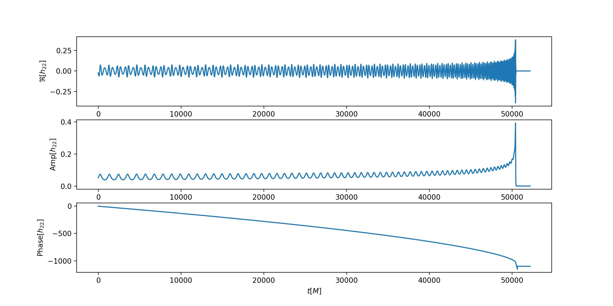

# pyWaveformGenerator
calculate GW waveform

Installation && compile
```
./mkconf.sh
./configure
make
```
sometimes the lib cannot use in Apple core macbook.


Run in python
```python
from pyWaveformGenerator.waveform import calculate_waveform
waveform, dynamics = calculate_waveform((10, 10, 
	0, 0, 0, 
	0, 0, 0, 
	0, 100, 
	0, 0, 0, 0), 20)
```
see more details and description in waveform.py

Cite this repo via [arXiv:2102.08614](https://arxiv.org/abs/2102.08614)  and [arXiv:2310.04552](https://arxiv.org/abs/2310.04552).

Generate eccentric-precession waveform, run

```python
from pyWaveformGenerator.waveform import calculate_waveform_ep
waveform, dynamics = calculate_waveform_ep((10, 10, 
	0.2, 0, 0, 
	0, -0.3, 0, 
	0.2, 100, 
	0, 0, 0, 0), 20, srate=16384, is_coframe=False)
```

In this case one have to make sure that one of $\chi_{1x,1y,2x,2y}\neq0$.

Then we can see the waveform

```Python
h22 = waveform.h22
fig = plt.figure(figsize = (12, 6))

ax1 = fig.add_subplot(3, 1, 1)
ax2 = fig.add_subplot(3, 1, 2)
ax3 = fig.add_subplot(3, 1, 3)

ax1.plot(h22.time, h22.real)
ax1.set_ylabel(r'$\Re[h_{22}]$')

ax2.plot(h22.time, h22.amp)
ax2.set_ylabel(r'${\rm Amp}[h_{22}]$')

ax3.plot(h22.time, h22.phase)
ax2.set_ylabel(r'${\rm Phase}[h_{22}]$')

plt.show()
```

which will looks like


